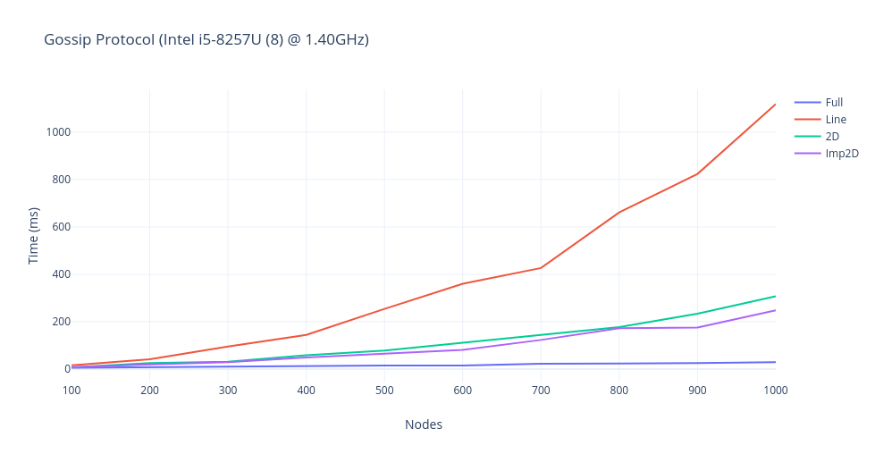
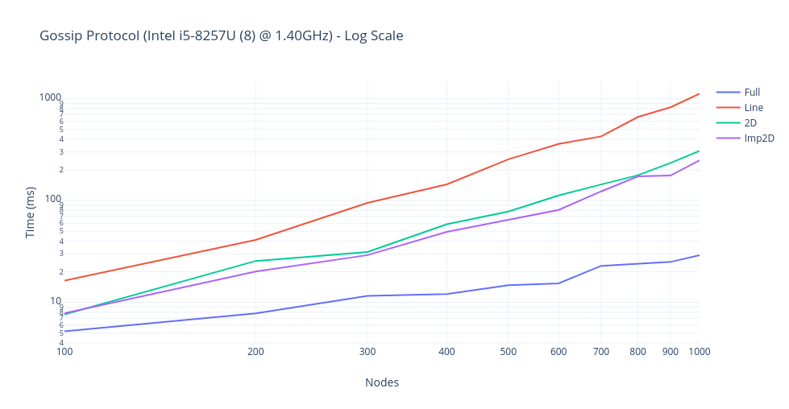
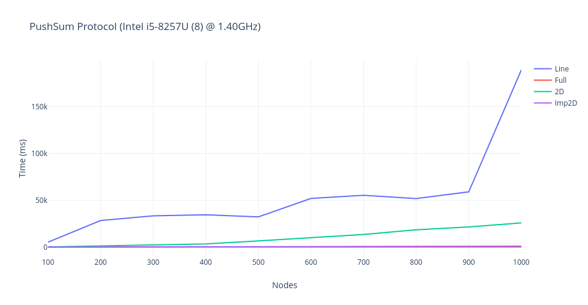
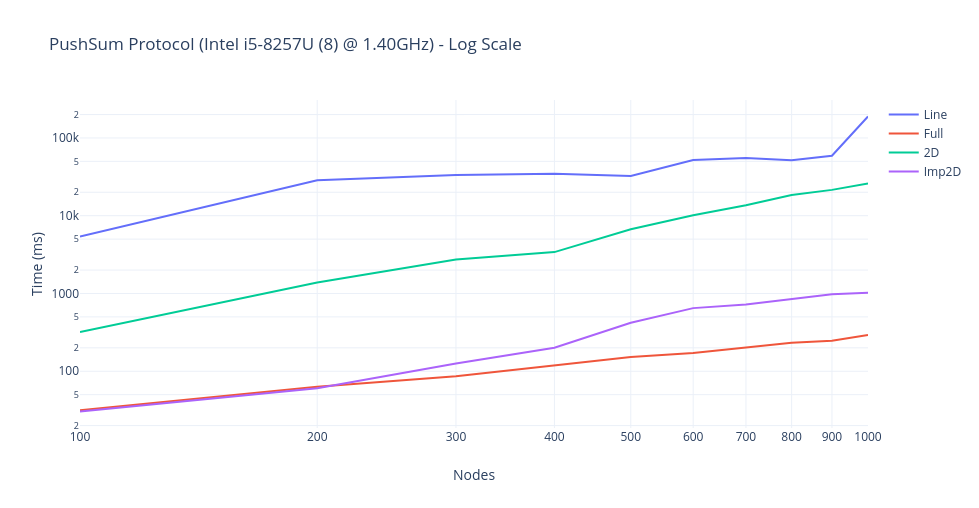
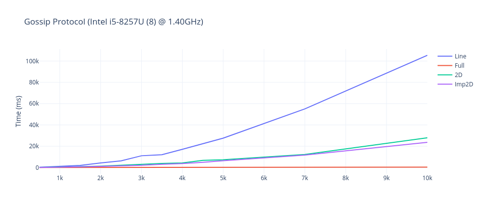
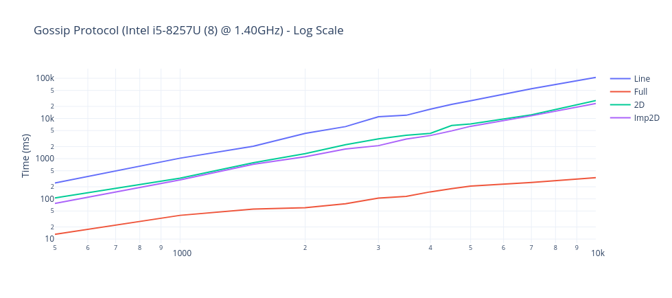
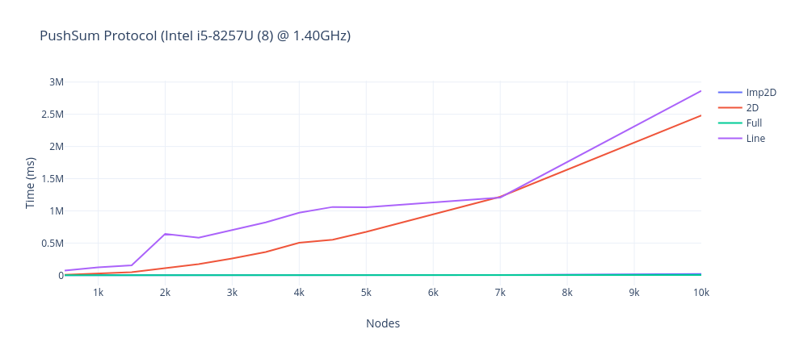
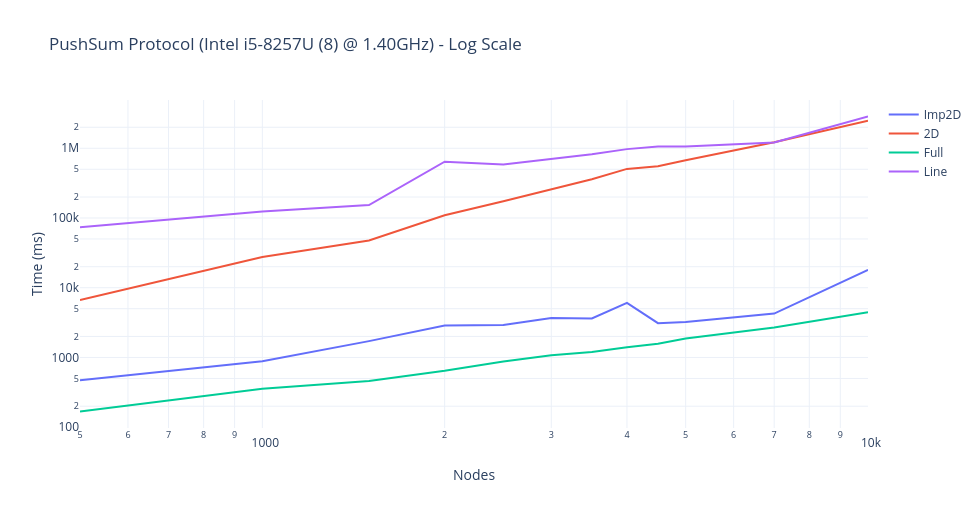

## Project 1 - Gossip Algorithm

#### Group Members:

* Shubham Chandak
* Arman Singhal

- - -

## Topologies:

1. **Full Network:** In this network, each node is connected to every other node. This is a representation of a fully-connected graph. This means that each node has multiple neighbours. This means that when a node is passing a message, it can pass the message to any of the other nodes including itself. So, we do not need to store the information about the nodes and their neighbours.
   &nbsp;
2. **2D Grid:** Is this network, the nodes are arranged in a grid pattern. So, each node is connected to 8 neighbours. To represent this connection we used a hashmap to store (i, j) coordinates of the nodes as the keys and the pids of the neighbour nodes as values of the map.
   &nbsp;
3. **Line:** In this network, each node have only two neighbours. One in the front and one in the back. There are two exceptions where the nodes are terminal. They will have only one neighbour. We used a hashmap to store the index as keys and pids of the neighbour nodes as the values.
   &nbsp;
4. **Imperfect 3D Grid:** In this network, each node is connected to 8 neighbours similar to a 2D grid but also connected to one extra neighbour in other plane. To represent this connection we used a hashmap to store (i, j, k) coordinates of the nodes as the keys and the pids of the neighbour nodes as values of the map.

## What is Working?

We able to run all `line`, `full`, `2D`, and `3D` in any combination with `gossip` or `push-sum` protocol. The convergence in Gossip protocol is achieved when all the nodes have converged. A node is set to be converged when it listens to the message for the 10th time. After convergence, the node stops transmitting the message to its neighbor. Once the network is converged i.e. all nodes are converged, the total time for convergence is printed out.

### Gossip

##### Normal Scale

* Line topology is the slowest to converge. This is due to the fact that it has only access to 2 neighbors (left and right node).
* Full topology is the fastest to converge in all possible scenarios. This is because it is connected to all the nodes and convergence is faster to achieve in this scenario
* As expected, 2D and imperfect 3D would achieve the convergence time in between the line and full with imperfect 3D performing slightly better or equal to 2D performance.

**Note:** All nodes weren't converging, on multiple runs we would notice that the convergence rate of topology would be 80-90%. This is because of the fact that the structure breaks while converging and some nodes are unreachable. In order to tackle this problem, we keep a track of all nodes that aren't converged, select one non converged node at random and keep sending messages till the time topology doesn't achieve the convergence.



##### Log Scale



### PushSum

The PushSum network works by sending message `s` and `w` as parameter to an actor. The intial value of `s` is equal to the index of the actor and `w = 1`. The propagation stops when an actor's `s/w` ratio does not change for 3 times in a row (i.e stays within limit of 10^-10)

**Note:** Unlike gossip algorithms, the push sum algorithm is able to converge in all topologies. We believe this is due to the fact we try to reduce the value s/w ratio till it does stop changing the ratio for consecutive three times. This allows in more messages being transmitted compared to the gossip algorithm allowing the network to converge. This also causes an increase in convergence time.

#### Linear Scale



#### Logarithmic Scale



## What is the largest network you managed to deal with for each type of topology and algorithm

The largest network that we have managed to solve is 10k nodes for each topology and algorithm. We decided to limit it to 10k node so that the network could be compared. Notice that other topologies (full, 2D, and imp3D) could run on larger nodes within a reasonable time frame.

The following are the result of running the topologies in different combinations.

### Gossip 10k

1. Normal Scale



2. Log Scale



### PushSum 10k

1. Linear Scale



2. Logarithmic Scale



## Interesting finds

* For the Gossip algorithm, Full topology beats hands down everyone else since every node is connected to every other node, the probability of receiving messages from other nodes increasing drastically. The blindspot (nodes that never converge) in the case of full topology is almost negligible. Therefore making it the best topology to spread the rumor.
* In the case of PushSum, if we reduce the gradient of s/w (i.e. `delta`) 10^-10 to 10^-5, the topology convergence time is also reduced to half.
* Line algorithm will perform poorly since the number of the neighbor is the smallest and thereby also increasing the chances of failure.

## How to run the program?

**Step 1:** Open terminal. Change your directory to the one containing files server.erl and worker.erl
   &nbsp;
**Step 2:** Compile server.erl using the command,
```erlang
c(server).
```
A message saying, {ok, server} will confirm the successfull compilation.
   &nbsp; 
**Step 3:** Compile actor.erl using the command,
```erlang
c(actor).
```
A message saying, {ok, worker} will confirm the successfull compilation.
   &nbsp;
**Step 4:** We will now spawn a new process using the following command.

```erlang
server:spawnProcess([Algorithm], [Topology], [Number of Nodes])

Eg: server:spawnProcess(gossip, line, 1000)
```
   &nbsp;
**Step 5:** To start a simulation, we have to send a message to one of the actor from command line.
```erlang
Eg: [Node PID] ! {[Server PID], gossip, "Hello"]}
```

**Expected Results:** List of tuples will pe printed where each tuple represents (Number of Nodes Terminated, Clock Time)